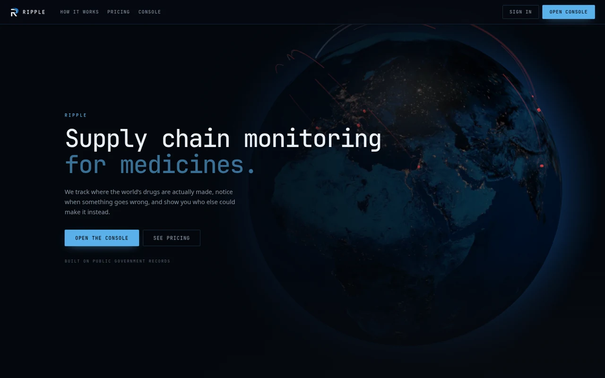
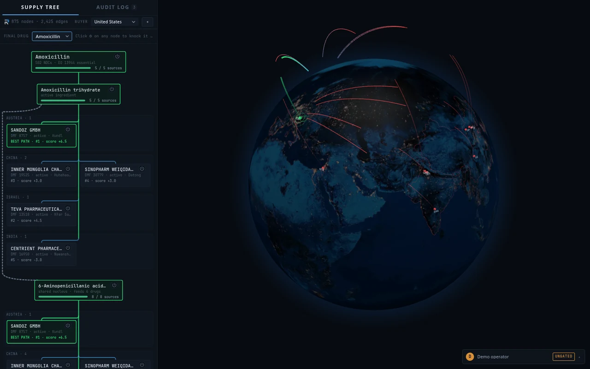
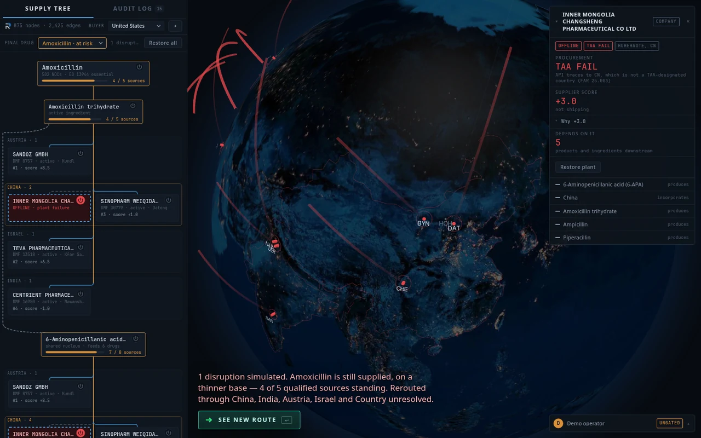
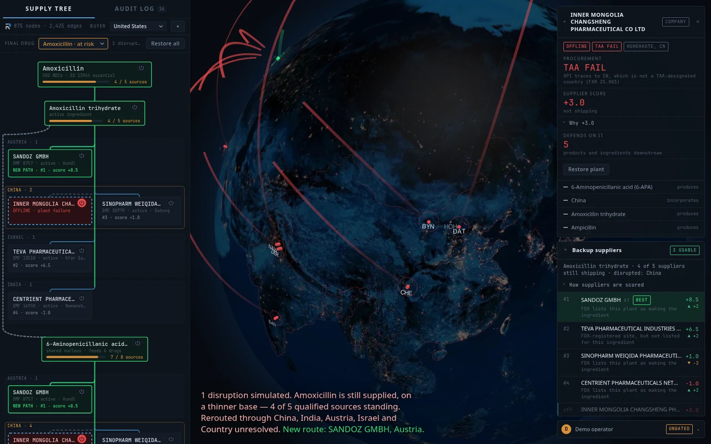
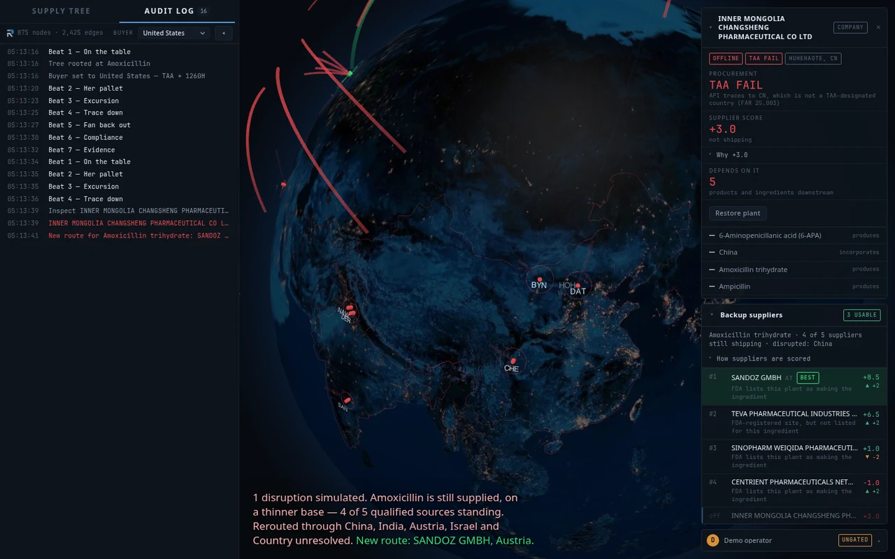

# RIPPLE — DNHacks_app

**Supply chain monitoring for medicines.** RIPPLE traces a hospital drug down to the
precursor it secretly shares with other drugs, shows where in the world that precursor
is actually made, and — when a plant goes down — ranks who else can make it, scored
against the buyer's procurement rules (TAA / 1260H).

Built for **DNHacks 2026** (Sept 5–6, 2026 · Station DC · Health & Public Service track).



## Quick start

```bash
make help                # see what's wired up
./scripts/bootstrap.sh   # install deps for whichever components exist
make dev                 # API on :8000, web on :3000
```

Then open <http://localhost:3000>. With no Supabase keys in `web/.env` the console at
`/app` is ungated — fine for local dev, see `web/middleware.ts` for why.

## Walkthrough

**1. Open the console.** The left rail is the supply tree for the selected drug:
drug → active ingredient → the DMF holders that can supply it, grouped by country, down
to the shared precursor (6-APA). The globe on the right draws the same routes. Change
the **Buyer** dropdown to re-judge every supplier against a different country's rules.



**2. Knock a plant out.** Click the ⏻ on any node to simulate its failure. The tree
re-scores, the affected drug goes amber, and the inspector on the right explains the
verdict (here: a Chinese plant fails the Trade Agreements Act for a US buyer).



**3. See the new route.** Press **Enter** (or *See new route*). The best remaining
supplier lights up green and the **Backup suppliers** panel lists every alternate,
ranked, with a one-line reason for each score.



**4. Check the audit log.** Every action — beats, buyer changes, failures, re-routes —
is timestamped in the **Audit Log** tab, so a decision can be replayed later.



**Keyboard:** `Space` / `→` next demo beat · `←` back · `Enter` show new route ·
`Esc` restore all plants · `R` reset · `G` toggle the globe.

## Repo layout

Polyglot monorepo. Each top-level directory is an independently ownable component.

| Path            | Component                                  | Stack |
|-----------------|--------------------------------------------|-------|
| `web/`          | Landing page + operator console            | Next.js 16 (App Router), TypeScript |
| `services/api/` | Depot telemetry ingest, SSE stream         | FastAPI |
| `hardware/`     | M5Stack depot node + host scripts          | PlatformIO, Arduino-ESP32 |
| `ml/`           | Graph build, scoring, backtest             | Python |
| `contracts/`    | **Shared API contracts** (source of truth) | JSON Schema + OpenAPI |
| `docs/`         | Architecture, demo script, runbook         | — |

## The one rule

**`contracts/` is decided before parallel work starts, and changes to it are announced.**
If you need a field that doesn't exist, change the contract *first*, then tell the team.

## Related

The **brain** repo (`../DNHacks_brain`) holds strategy, demo path, team assignments,
and the Claude Code agents that coordinate this build. Start there when you're lost.
